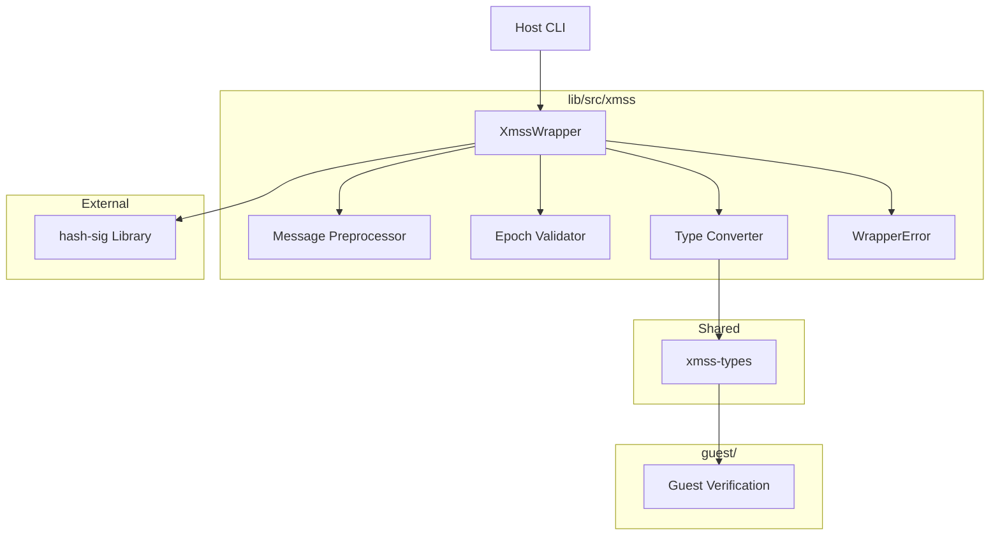
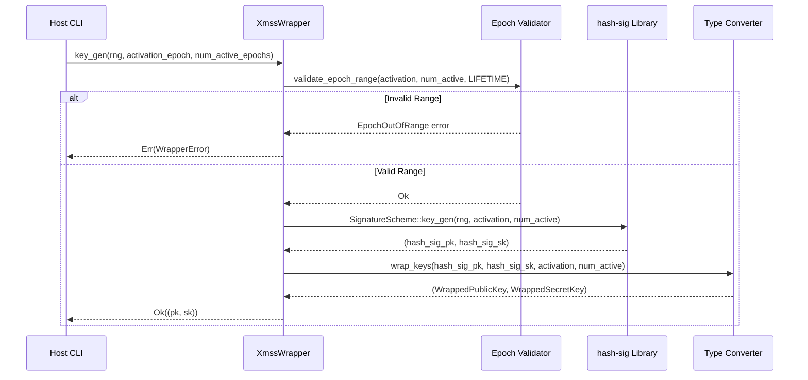
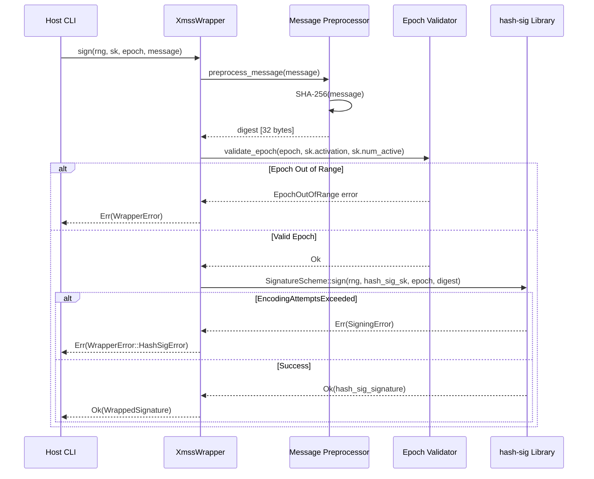
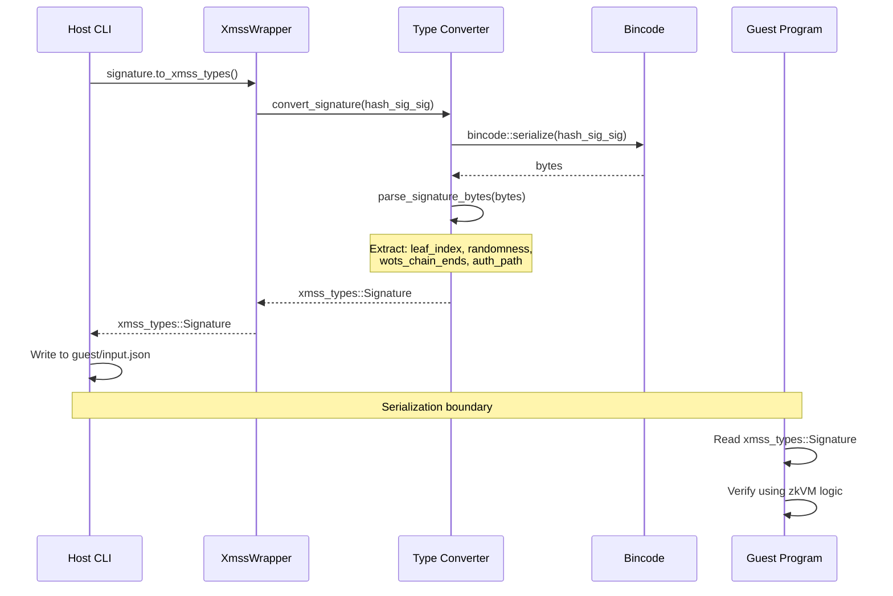
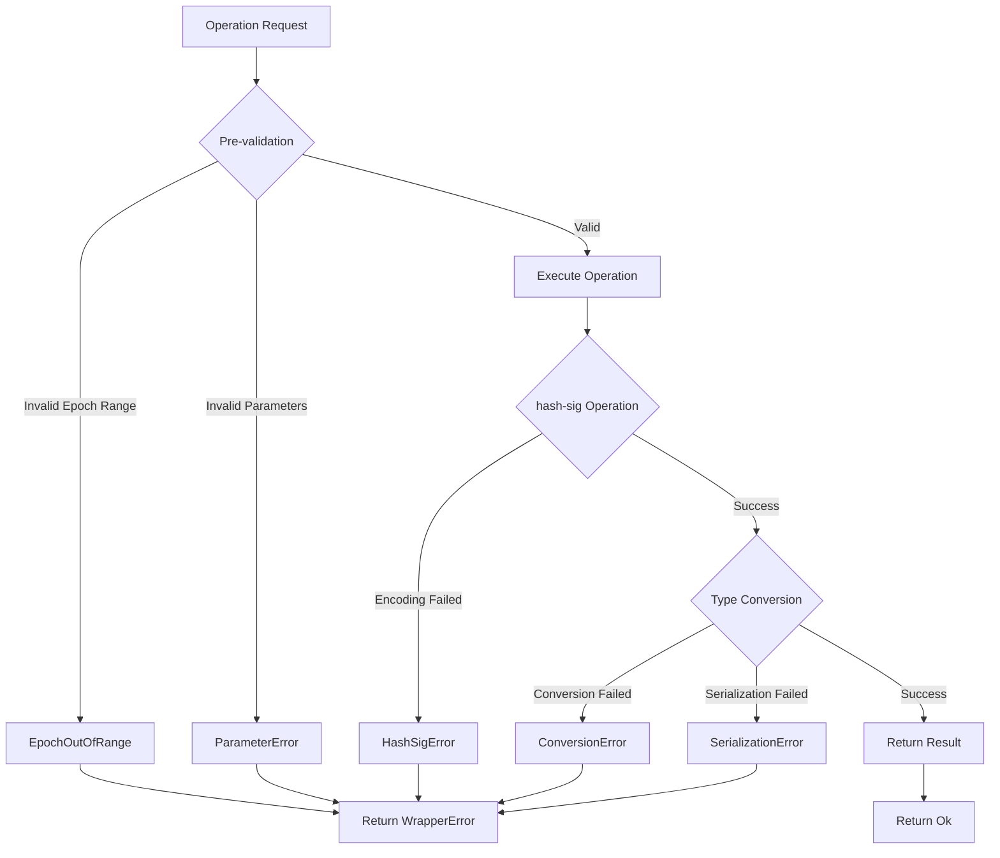

# Technical Design: hash-sig-wrapper

## Overview

The hash-sig wrapper layer provides a type-safe, ergonomic Rust API over the hash-sig XMSS library, enabling seamless integration into OpenVM-XMSS's host-guest zkVM architecture. This wrapper addresses the fundamental impedance mismatch between hash-sig's low-level cryptographic primitives (32-byte fixed messages, opaque types, epoch-based signing) and OpenVM-XMSS's requirements for arbitrary message lengths, xmss-types compatibility, and no_std guest environments.

The wrapper acts as an adaptation layer residing in `lib/src/xmss/`, exposing a clean API for key generation, signing, and verification while handling message preprocessing, epoch validation, and type conversions transparently. The design ensures that host applications work with familiar patterns while guest programs receive properly formatted data structures for zkVM verification.

This design maintains backward compatibility with existing xmss-types structures, enabling gradual migration from the previous custom XMSS implementation to hash-sig without disrupting the host CLI, guest verification logic, or OpenVM integration layer.

### Goals

- Provide ergonomic wrapper API over hash-sig's SignatureScheme trait with message preprocessing and epoch validation
- Enable bidirectional conversion between hash-sig types and xmss-types for host-guest communication
- Support multiple XMSS parameter sets through generic type parameters or configuration enums
- Deliver comprehensive error handling with actionable diagnostics for integration debugging
- Maintain no_std compatibility for type conversion utilities used in guest programs

### Non-Goals

- Re-implementing XMSS cryptographic primitives (delegated to hash-sig library)
- Automatic epoch state management or persistent epoch tracking (explicit caller responsibility)
- Performance optimization beyond hash-sig's capabilities (no custom hash implementations)
- Guest-side signing operations (hash-sig requires std; guest only verifies)
- Multi-threaded signing coordination or distributed epoch allocation

## Architecture

### Existing Architecture Analysis

The OpenVM-XMSS architecture follows a host-guest zkVM pattern with clear separation:

**Current Structure:**
- `lib/src/zkvm/host.rs` - Host-side proof generation orchestration
- `lib/src/zkvm/guest.rs` - Guest-side utilities and interfaces
- `xmss-types/` - Shared types with no_std support for host-guest serialization
- `host/` - CLI application using xmss-lib and invoking OpenVM
- `guest/` - zkVM program performing signature verification

**Existing Patterns to Preserve:**
- Library-first design: Core logic in `xmss-lib`, CLI wraps library
- Domain separation: XMSS operations in `lib/src/xmss/`, zkVM integration in `lib/src/zkvm/`
- Conversion layer pattern: `lib/src/xmss/conversions.rs` abstracts external dependencies
- Type sharing: xmss-types provides serialization boundary between host and guest

**Integration Points:**
- The wrapper will be consumed by `host/src/commands/` for CLI operations
- Conversion utilities will be used by guest verification logic
- xmss-types remains the canonical format for host-guest communication

### High-Level Architecture



**Architecture Integration:**
- **Existing patterns preserved**: Conversion layer isolates hash-sig, maintains clean internal API
- **New components rationale**:
  - XmssWrapper: Provides ergonomic API and coordinates preprocessing/validation
  - Message Preprocessor: Handles 32-byte constraint transparently
  - Epoch Validator: Prevents OTS reuse with explicit range checking
  - Type Converter: Bridges hash-sig's opaque types with xmss-types
- **Technology alignment**: Uses existing serde/bincode stack, SHA-256 from sha2 crate
- **Steering compliance**: Follows module hierarchy, domain separation, library-first design

### Technology Alignment

The wrapper integrates into the established OpenVM-XMSS technology stack:

**Core Dependencies (Existing):**
- `hashsig` - XMSS implementation (workspace dependency)
- `serde` 1.0 - Serialization with no_std support
- `bincode` 1.3 - Binary serialization for type conversions
- `sha2` 0.10 - SHA-256 for message preprocessing
- `rand` 0.8 - RNG abstraction (note: hash-sig requires 0.9, needs update)

**New Dependencies Required:**
- Upgrade `rand` to 0.9 in workspace to match hash-sig requirements

**Architecture Pattern:**
- **Adapter Pattern**: Wrapper adapts hash-sig's interface to OpenVM-XMSS requirements
- **Facade Pattern**: Single XmssWrapper API hides preprocessing, validation, conversion complexity

**Deviation from Established Patterns:**
- rand version upgrade from 0.8 to 0.9 required for hash-sig compatibility

### Key Design Decisions

#### Decision 1: Serialization-Based Type Conversion

**Context:** hash-sig's Signature and PublicKey types are opaque structs without public field access, but xmss-types expects decomposed structures (leaf_index, randomness, wots_chain_ends, auth_path).

**Alternatives:**
1. **Direct Field Access**: Attempt to expose hash-sig's internal fields via traits or wrapper access methods
2. **Serialization Intermediate**: Use bincode to serialize hash-sig types, then deserialize into xmss-types format
3. **Parallel Construction**: Generate signatures with both hash-sig and custom implementation, discard custom

**Selected Approach:** Serialization Intermediate (Alternative 2)

Convert hash-sig types to/from xmss-types through this flow:
1. hash-sig Signature → bincode bytes → custom deserialization → xmss-types::Signature
2. Parse bincode bytes to extract leaf_index, randomness, wots_chain_ends, auth_path fields
3. Reverse for xmss-types → hash-sig conversions

**Rationale:**
- hash-sig types already implement Serialize/Deserialize (required by SignatureScheme trait)
- Serialization provides stable binary format independent of hash-sig's internal representation
- No need to maintain fork or modify hash-sig library to expose internal fields
- Allows versioning and schema evolution through custom deserialization logic

**Trade-offs:**
- **Gain**: Clean separation from hash-sig internals, upgrade compatibility
- **Sacrifice**: Additional serialization overhead (mitigated: conversions happen once per signature, not in hot path)
- **Risk**: Binary format changes in hash-sig could break conversions (mitigation: integration tests with golden vectors)

#### Decision 2: Always-Hash Message Preprocessing

**Context:** hash-sig requires exactly 32-byte messages, but OpenVM-XMSS workflows use arbitrary-length messages (Vec<u8>).

**Alternatives:**
1. **Always Hash**: Always apply SHA-256 to messages regardless of length
2. **Conditional Hash**: Only hash if message length ≠ 32 bytes, use directly if exactly 32 bytes
3. **Caller Responsibility**: Require callers to pre-hash messages before passing to wrapper

**Selected Approach:** Always Hash (Alternative 1)

All messages pass through SHA-256 preprocessing:
```
message (arbitrary bytes) → SHA-256 → 32-byte digest → hash-sig sign/verify
```

**Rationale:**
- **Consistency**: Same preprocessing path regardless of input length prevents subtle bugs
- **Security**: Hashing prevents length-extension attacks and ensures uniform 32-byte distribution
- **API Simplicity**: Callers don't need to know about 32-byte constraint
- **Compatibility**: Matches OpenVM's accelerated SHA-256 primitives (openvm-sha2)

**Trade-offs:**
- **Gain**: Simple API, consistent behavior, no special cases for 32-byte inputs
- **Sacrifice**: One extra hash for messages that are already 32 bytes (minimal overhead)
- **Documentation**: Must clearly document that sign(msg) actually signs SHA-256(msg)

#### Decision 3: Pre-Validation Epoch Management

**Context:** hash-sig allows specifying activation_epoch and num_active_epochs at key generation, but sign() doesn't automatically track used epochs.

**Alternatives:**
1. **Delegate to hash-sig**: Pass epoch directly to sign(), rely on hash-sig to reject invalid epochs
2. **Pre-validate**: Check epoch validity in wrapper before calling hash-sig
3. **Stateful Tracking**: Maintain used epoch set in wrapper, auto-increment on signing

**Selected Approach:** Pre-validate (Alternative 2)

Wrapper validates epoch ranges before delegating to hash-sig:
- Store activation_epoch and num_active_epochs with SecretKey wrapper
- On sign(epoch), check: `activation_epoch <= epoch < activation_epoch + num_active_epochs`
- Return WrapperError::EpochOutOfRange if validation fails
- Delegate to hash-sig only after validation succeeds

**Rationale:**
- **Early Error Detection**: Fail fast with actionable error messages before expensive signature computation
- **Security**: Explicit validation prevents accidental OTS reuse through epoch miscalculation
- **Diagnostics**: Wrapper error includes actual epoch, valid range, and LIFETIME for debugging
- **Stateless**: No automatic increment maintains explicit control (caller manages epoch state)

**Trade-offs:**
- **Gain**: Better error messages, fail-fast semantics, explicit epoch control
- **Sacrifice**: Slight overhead of validation check (trivial integer comparison)
- **Design**: Caller remains responsible for epoch tracking (intentional: prevents hidden state)

## System Flows

### Key Generation Flow



### Signing Flow



### Type Conversion Flow (Host to Guest)



## Requirements Traceability

| Requirement | Summary | Components | Interfaces | Flows |
|-------------|---------|------------|------------|-------|
| 1.1-1.6 | Hash-sig API Abstraction | XmssWrapper | key_gen(), sign(), verify() | Key Generation, Signing |
| 2.1-2.5 | Message Length Adaptation | MessagePreprocessor | preprocess_message() | Signing, Verification |
| 3.1-3.6 | Epoch Management | EpochValidator | validate_epoch_range(), validate_epoch() | Key Generation, Signing |
| 4.1-4.7 | Type System Compatibility | TypeConverter | to_xmss_types(), from_xmss_types() | Type Conversion |
| 5.1-5.5 | No_std Compatibility | TypeConverter (no_std mode) | Conditional compilation | Type Conversion |
| 6.1-6.6 | Error Handling | WrapperError | Display, From traits | All flows |
| 7.1-7.4 | RNG Integration | XmssWrapper | RngCore parameter | Key Generation, Signing |
| 8.1-8.5 | Parameter Selection | XmssConfig, ParameterSet | Type parameter, metadata() | Key Generation |
| 9.1-9.5 | Serialization | All wrapper types | Serialize, Deserialize | Type Conversion |
| 10.1-10.6 | Testing Hooks | test_utils module | test_key_gen(), golden_vectors | Testing |

## Components and Interfaces

### XMSS Wrapper Layer

#### XmssWrapper<S: SignatureScheme>

**Responsibility & Boundaries**
- **Primary Responsibility**: Provide ergonomic API over hash-sig's SignatureScheme with message preprocessing, epoch validation, and type conversion
- **Domain Boundary**: XMSS cryptographic operations layer (lib/src/xmss/)
- **Data Ownership**: Wraps hash-sig key and signature types with additional metadata (epoch ranges)
- **Transaction Boundary**: Single signature operation (no distributed coordination)

**Dependencies**
- **Inbound**: Host CLI commands (prove, verify), test utilities
- **Outbound**: hash-sig SignatureScheme trait, MessagePreprocessor, EpochValidator, TypeConverter
- **External**: hashsig crate, rand::RngCore, sha2::Sha256

**Contract Definition**

**Service Interface:**
```rust
// Type parameter S is the hash-sig SignatureScheme concrete type
// e.g., SIGWinternitzLifetime10W4
pub struct XmssWrapper<S: SignatureScheme> {
    _phantom: PhantomData<S>,
}

impl<S: SignatureScheme> XmssWrapper<S> {
    /// Generate XMSS key pair with epoch range
    ///
    /// Preconditions:
    /// - activation_epoch + num_active_epochs <= S::LIFETIME
    /// - rng implements rand::RngCore
    ///
    /// Postconditions:
    /// - Returns wrapped keys containing epoch metadata
    /// - Keys are valid for epochs [activation_epoch, activation_epoch + num_active_epochs)
    ///
    /// Invariants:
    /// - Secret key epoch range never changes after generation
    fn key_gen<R: RngCore>(
        rng: &mut R,
        activation_epoch: u32,
        num_active_epochs: u32,
    ) -> Result<(WrappedPublicKey<S>, WrappedSecretKey<S>), WrapperError>;

    /// Sign message with XMSS secret key at specific epoch
    ///
    /// Preconditions:
    /// - epoch is within secret key's active range
    /// - message can be any length (will be hashed to 32 bytes)
    /// - rng implements rand::RngCore
    ///
    /// Postconditions:
    /// - Returns signature valid for SHA-256(message) at epoch
    /// - Secret key unchanged (no automatic epoch increment)
    ///
    /// Invariants:
    /// - Same message + epoch always produces valid signature (probabilistic)
    fn sign<R: RngCore>(
        rng: &mut R,
        sk: &WrappedSecretKey<S>,
        epoch: u32,
        message: &[u8],
    ) -> Result<WrappedSignature<S>, WrapperError>;

    /// Verify XMSS signature
    ///
    /// Preconditions:
    /// - message can be any length (will be hashed to 32 bytes)
    ///
    /// Postconditions:
    /// - Returns true if signature is valid for SHA-256(message) at epoch
    /// - Returns false otherwise (no error for invalid signatures)
    ///
    /// Invariants:
    /// - Deterministic: same inputs always produce same result
    fn verify(
        pk: &WrappedPublicKey<S>,
        epoch: u32,
        message: &[u8],
        signature: &WrappedSignature<S>,
    ) -> bool;

    /// Query parameter metadata
    fn metadata() -> ParameterMetadata;
}
```

**State Management:**
- **State Model**: Stateless (epoch metadata stored in WrappedSecretKey)
- **Persistence**: Not handled by wrapper (caller responsibility via serialization)
- **Concurrency**: Thread-safe (no shared mutable state)

#### MessagePreprocessor

**Responsibility & Boundaries**
- **Primary Responsibility**: Convert arbitrary-length messages to 32-byte digests via SHA-256
- **Domain Boundary**: Message preprocessing utility (lib/src/xmss/message.rs)
- **Data Ownership**: No state (pure function)

**Contract Definition:**

```rust
pub struct MessagePreprocessor;

impl MessagePreprocessor {
    /// Hash message to 32-byte digest using SHA-256
    ///
    /// Preconditions: None (accepts any byte slice)
    /// Postconditions: Returns exactly 32 bytes
    /// Invariants: Same input always produces same output (deterministic hash)
    pub fn preprocess(message: &[u8]) -> [u8; 32];
}
```

#### EpochValidator

**Responsibility & Boundaries**
- **Primary Responsibility**: Validate epoch values against key activation ranges and LIFETIME constants
- **Domain Boundary**: Epoch validation utility (lib/src/xmss/epoch.rs)
- **Data Ownership**: No state (pure validation logic)

**Contract Definition:**

```rust
pub struct EpochValidator;

impl EpochValidator {
    /// Validate epoch range at key generation
    ///
    /// Preconditions:
    /// - lifetime is SignatureScheme::LIFETIME constant
    ///
    /// Postconditions:
    /// - Returns Ok if activation_epoch + num_active_epochs <= lifetime
    /// - Returns Err(EpochOutOfRange) otherwise
    ///
    /// Invariants:
    /// - Deterministic validation based on integer arithmetic
    pub fn validate_epoch_range(
        activation_epoch: u32,
        num_active_epochs: u32,
        lifetime: u32,
    ) -> Result<(), WrapperError>;

    /// Validate epoch for signing operation
    ///
    /// Preconditions:
    /// - activation_epoch and num_active_epochs from WrappedSecretKey
    ///
    /// Postconditions:
    /// - Returns Ok if activation_epoch <= epoch < activation_epoch + num_active_epochs
    /// - Returns Err(EpochOutOfRange) otherwise
    ///
    /// Invariants:
    /// - Deterministic validation based on range check
    pub fn validate_epoch(
        epoch: u32,
        activation_epoch: u32,
        num_active_epochs: u32,
    ) -> Result<(), WrapperError>;
}
```

#### TypeConverter

**Responsibility & Boundaries**
- **Primary Responsibility**: Bidirectional conversion between hash-sig types and xmss-types
- **Domain Boundary**: Type conversion layer (lib/src/xmss/conversions.rs)
- **Data Ownership**: No state (conversion functions)
- **Transaction Boundary**: Single type conversion

**Dependencies**
- **Inbound**: XmssWrapper, guest verification logic
- **Outbound**: hash-sig types, xmss-types, bincode
- **External**: serde, bincode (with no_std support)

**Contract Definition:**

```rust
pub struct TypeConverter;

impl TypeConverter {
    /// Convert hash-sig Signature to xmss-types::Signature
    ///
    /// Preconditions:
    /// - hash_sig_signature is valid serializable signature
    ///
    /// Postconditions:
    /// - Returns xmss_types::Signature with extracted fields
    /// - Preserves cryptographic material exactly
    ///
    /// Process:
    /// 1. Serialize hash-sig signature to bincode bytes
    /// 2. Parse bytes to extract leaf_index, randomness, wots_chain_ends, auth_path
    /// 3. Construct xmss_types::Signature from extracted fields
    pub fn to_xmss_signature<S: SignatureScheme>(
        hash_sig_signature: &S::Signature,
    ) -> Result<xmss_types::Signature, WrapperError>;

    /// Convert xmss-types::Signature to hash-sig Signature
    ///
    /// Preconditions:
    /// - xmss_sig contains valid field data
    ///
    /// Postconditions:
    /// - Returns hash-sig Signature reconstructed from fields
    /// - Signature is cryptographically equivalent to original
    ///
    /// Process:
    /// 1. Construct bincode bytes from xmss_types fields
    /// 2. Deserialize bytes into hash-sig Signature type
    pub fn from_xmss_signature<S: SignatureScheme>(
        xmss_sig: &xmss_types::Signature,
    ) -> Result<S::Signature, WrapperError>;

    /// Convert hash-sig PublicKey to xmss-types::PublicKey
    pub fn to_xmss_public_key<S: SignatureScheme>(
        hash_sig_pk: &S::PublicKey,
    ) -> Result<xmss_types::PublicKey, WrapperError>;

    /// Convert xmss-types::PublicKey to hash-sig PublicKey
    pub fn from_xmss_public_key<S: SignatureScheme>(
        xmss_pk: &xmss_types::PublicKey,
    ) -> Result<S::PublicKey, WrapperError>;
}

// No_std compatibility via conditional compilation
#[cfg(not(feature = "std"))]
impl TypeConverter {
    // Same interface, uses alloc instead of std
}
```

**Integration Strategy:**
- **Modification Approach**: Extend existing lib/src/xmss/ module (currently empty)
- **Backward Compatibility**: xmss-types remains unchanged; conversion layer maintains compatibility
- **Migration Path**: Host code migrates from old XMSS to XmssWrapper incrementally

### Configuration and Parameter Management

#### ParameterSet and XmssConfig

**Responsibility & Boundaries**
- **Primary Responsibility**: Provide type-safe parameter selection and metadata access
- **Domain Boundary**: Configuration layer (lib/src/xmss/config.rs)
- **Data Ownership**: Constants and metadata for hash-sig instantiations

**Contract Definition:**

```rust
/// XMSS parameter set configuration
pub enum ParameterSet {
    /// SHA-256, tree height 10, Winternitz parameter 4
    /// LIFETIME = 2^10 = 1024 signatures
    SHA256_H10_W4,

    /// SHA-256, tree height 16, Winternitz parameter 4
    /// LIFETIME = 2^16 = 65536 signatures
    SHA256_H16_W4,

    /// SHA-256, tree height 20, Winternitz parameter 4
    /// LIFETIME = 2^20 = 1048576 signatures
    SHA256_H20_W4,
}

impl ParameterSet {
    /// Get hash-sig instantiation type for this parameter set
    pub fn instantiation_type(&self) -> &'static str;

    /// Get metadata for this parameter set
    pub fn metadata(&self) -> ParameterMetadata;
}

/// Metadata for XMSS parameter set
pub struct ParameterMetadata {
    pub lifetime: u32,
    pub tree_height: u16,
    pub winternitz_parameter: u16,
    pub hash_function: &'static str,
    pub signature_size_bytes: usize,
    pub public_key_size_bytes: usize,
}

impl ParameterMetadata {
    /// Convert to xmss_types::TslParams
    pub fn to_tsl_params(&self) -> xmss_types::TslParams;
}
```

### Error Handling

#### WrapperError

**Responsibility & Boundaries**
- **Primary Responsibility**: Comprehensive error taxonomy for wrapper layer failures
- **Domain Boundary**: Error types (lib/src/xmss/error.rs)

**Contract Definition:**

```rust
#[derive(Debug, thiserror::Error)]
pub enum WrapperError {
    /// Hash-sig library error (wraps underlying error)
    #[error("Hash-sig error: {0}")]
    HashSigError(#[from] hashsig::SigningError),

    /// Epoch value outside valid range for secret key
    #[error("Epoch {epoch} outside valid range [{activation_epoch}, {end_epoch}) for LIFETIME {lifetime}")]
    EpochOutOfRange {
        epoch: u32,
        activation_epoch: u32,
        end_epoch: u32,
        lifetime: u32,
    },

    /// Type conversion failed between hash-sig and xmss-types
    #[error("Type conversion failed: {reason}")]
    ConversionError { reason: String },

    /// Message hashing failed (should never happen with SHA-256)
    #[error("Message hashing failed: {0}")]
    MessageHashingError(String),

    /// Serialization/deserialization error
    #[error("Serialization error: {0}")]
    SerializationError(#[from] bincode::Error),

    /// Parameter configuration error
    #[error("Invalid parameter configuration: {0}")]
    ParameterError(String),
}
```

## Data Models

### Wrapper Type System

The wrapper introduces three primary types that encapsulate hash-sig types with additional metadata:

```rust
/// Wrapped public key with parameter metadata
#[derive(Debug, Clone, Serialize, Deserialize)]
pub struct WrappedPublicKey<S: SignatureScheme> {
    /// Underlying hash-sig public key
    inner: S::PublicKey,
    /// Parameter set metadata
    params: ParameterMetadata,
}

/// Wrapped secret key with epoch range metadata
#[derive(Debug, Clone, Serialize, Deserialize)]
pub struct WrappedSecretKey<S: SignatureScheme> {
    /// Underlying hash-sig secret key
    inner: S::SecretKey,
    /// Activation epoch (start of valid range)
    activation_epoch: u32,
    /// Number of active epochs (range size)
    num_active_epochs: u32,
    /// Parameter set metadata
    params: ParameterMetadata,
}

/// Wrapped signature
#[derive(Debug, Clone, Serialize, Deserialize)]
pub struct WrappedSignature<S: SignatureScheme> {
    /// Underlying hash-sig signature
    inner: S::Signature,
    /// Epoch at which signature was created
    epoch: u32,
}
```

**Invariants:**
- WrappedSecretKey: `activation_epoch + num_active_epochs <= params.lifetime`
- WrappedSignature: `epoch` was within valid range when created
- All inner types implement Serialize + Deserialize (enforced by SignatureScheme trait)

### Type Conversion Data Flow

**Hash-sig to xmss-types:**
```
hash-sig::Signature
  ↓ bincode::serialize()
[bytes: leaf_index (4) | randomness (n) | wots_chain_ends (v*n) | auth_path (h*n)]
  ↓ custom parser
xmss_types::Signature {
    leaf_index: u32,
    randomness: Vec<u8>,
    wots_chain_ends: Vec<Vec<u8>>,
    auth_path: Vec<Vec<u8>>,
}
```

**xmss-types to hash-sig:**
```
xmss_types::Signature
  ↓ construct bytes
[bytes: leaf_index | randomness | wots_chain_ends | auth_path]
  ↓ bincode::deserialize()
hash-sig::Signature
```

**Serialization Format (Bincode):**
- Little-endian encoding
- Length-prefixed vectors (u64 length + elements)
- Fixed-size integers (u32, u16) in native representation

## Error Handling

### Error Strategy

The wrapper employs a fail-fast error strategy with comprehensive diagnostics:

1. **Pre-validation**: Check preconditions before expensive operations (epoch validation before signing)
2. **Error Wrapping**: Wrap hash-sig errors with context (preserve original error, add wrapper context)
3. **Explicit Errors**: Return Result types for all fallible operations (no panics in library code)
4. **Actionable Messages**: Include actual values, expected ranges, and suggestions in error messages

### Error Categories and Responses

**User Errors (Caller Mistakes):**
- **Invalid Epoch Range**: `activation_epoch + num_active_epochs > LIFETIME`
  - Response: Return EpochOutOfRange with calculated range and LIFETIME
  - Guidance: "Reduce num_active_epochs or choose parameter set with higher LIFETIME"
- **Epoch Out of Range**: Signing with epoch outside active range
  - Response: Return EpochOutOfRange with requested epoch and valid range
  - Guidance: "Use epoch in range [activation, end) or generate new keys"

**System Errors (Hash-sig Issues):**
- **Encoding Attempts Exceeded**: hash-sig probabilistic encoding failed
  - Response: Wrap SigningError::EncodingAttemptsExceeded
  - Guidance: "Retry signing operation (probabilistic failure)"
- **Serialization Failure**: bincode serialization failed
  - Response: Return SerializationError with bincode details
  - Guidance: "Check type compatibility and data validity"

**Business Logic Errors (Integration Issues):**
- **Type Conversion Failure**: Cannot convert between hash-sig and xmss-types
  - Response: Return ConversionError with reason (field mismatch, size incompatibility)
  - Guidance: "Verify hash-sig instantiation matches expected xmss-types schema"

**Error Flow Visualization:**


### Monitoring

**Error Tracking:**
- All WrapperError variants implement Display and Debug for logging
- Errors include structured context (epoch values, ranges, lifetimes) for metrics
- Recommended: Track EpochOutOfRange frequency to detect epoch management bugs

**Logging Strategy:**
- Wrapper does not perform logging (library responsibility boundary)
- Callers log WrapperError with tracing or log crate
- Error Display impl provides human-readable messages

**Health Monitoring:**
- Track signing success/failure rates (EncodingAttemptsExceeded frequency)
- Monitor conversion error rates (indicates hash-sig version incompatibility)
- Alert on ParameterError (configuration issues)

## Testing Strategy

### Unit Tests

**Core Wrapper Functionality (lib/src/xmss/wrapper.rs):**
- `test_key_gen_valid_epoch_range` - Generate keys with valid epoch range
- `test_key_gen_invalid_epoch_range` - Reject epoch range exceeding LIFETIME
- `test_sign_valid_epoch` - Sign message with epoch in valid range
- `test_sign_invalid_epoch` - Reject signing with epoch outside range
- `test_verify_valid_signature` - Verify correctly signed message

**Message Preprocessing (lib/src/xmss/message.rs):**
- `test_preprocess_arbitrary_message` - Hash various message lengths to 32 bytes
- `test_preprocess_deterministic` - Same message produces same digest
- `test_preprocess_32_byte_message` - Handle exactly 32-byte messages

**Epoch Validation (lib/src/xmss/epoch.rs):**
- `test_validate_epoch_range_valid` - Accept valid ranges
- `test_validate_epoch_range_exceeds_lifetime` - Reject overflow
- `test_validate_epoch_in_range` - Accept epochs within range
- `test_validate_epoch_out_of_range` - Reject epochs outside range

**Type Conversion (lib/src/xmss/conversions.rs):**
- `test_signature_roundtrip` - hash-sig → xmss-types → hash-sig preserves data
- `test_public_key_roundtrip` - Public key conversion preserves cryptographic material
- `test_conversion_field_extraction` - Verify correct field parsing from bincode

### Integration Tests

**End-to-End Workflows (lib/tests/wrapper_integration.rs):**
- `test_key_gen_sign_verify_workflow` - Complete workflow with XmssWrapper
- `test_multi_signature_workflow` - Generate multiple signatures at different epochs
- `test_host_guest_type_conversion` - Simulate host generating signature, guest receiving xmss-types

**Error Handling (lib/tests/error_handling.rs):**
- `test_encoding_attempts_exceeded_propagation` - Verify SigningError wrapping
- `test_epoch_error_includes_metadata` - Check error message contains debug info
- `test_conversion_error_recovery` - Ensure conversion failures don't panic

**Parameter Sets (lib/tests/parameter_sets.rs):**
- `test_parameter_set_metadata` - Verify metadata matches hash-sig constants
- `test_tsl_params_conversion` - Convert ParameterMetadata to TslParams correctly
- `test_all_parameter_sets` - Test key generation with each ParameterSet variant

### Compilation Tests

**No_std Compatibility (lib/tests/no_std_compile.rs):**
- `test_type_converter_no_std` - Compile TypeConverter with no_std feature
- `test_xmss_types_no_std` - Verify xmss-types compiles without std
- Note: Test compilation only (no_std code cannot run in std test harness)

### Test Utilities

**Golden Vectors (lib/tests/golden_vectors/):**
- Pre-generated signatures with known-good hash-sig implementation
- Test vectors include: epoch, message, signature, public key
- Verify wrapper produces compatible signatures

**Test Helpers (lib/src/xmss/test_utils.rs):**
```rust
#[cfg(test)]
pub mod test_utils {
    /// Generate deterministic keys for testing
    pub fn test_key_gen<S: SignatureScheme>() -> (WrappedPublicKey<S>, WrappedSecretKey<S>);

    /// Seeded RNG for reproducible tests
    pub fn test_rng() -> rand::rngs::StdRng;

    /// Load golden test vectors
    pub fn load_golden_vectors() -> Vec<GoldenVector>;
}
```

**Coverage Targets:**
- Unit test coverage: >90% for wrapper, preprocessor, validator, converter
- Integration test coverage: All primary workflows (keygen, sign, verify, convert)
- Error path coverage: Every WrapperError variant triggered in tests
